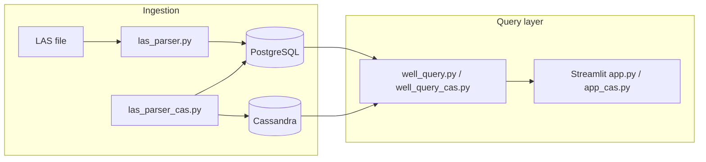

# Geoscience Well Log Database (DB_ToyImp)

Toy implementation of a **well log database** for geoscientists — ingest LAS files, standardize curve mnemonics at load time, and query depth-indexed measurements across wells. Built as a Memorial University group project comparing **PostgreSQL** and **Apache Cassandra** backends on real **Hibernia B-16 2Z** data from Newfoundland.

**Engineering write-up:** [Building a Well Log Database](https://technest-week-2.vercel.app/blog/building-a-well-log-database-schema-design-mnemonic-standardization-and-a-tale-of-two-backends) · **Author:** [Kwame Essuman](https://github.com/kaybee77)

**Team:** Dang Tran · J Chris Pickett · Kwame Essuman · Arnob

## Tech stack

| Layer | Technology |
| --- | --- |
| Language | Python 3.11 |
| LAS parsing | lasio |
| Primary store | PostgreSQL 16 (psycopg2) |
| Alternate store | Apache Cassandra 4.1 (wide-column curves) |
| UI | Streamlit |
| Bulk load | PostgreSQL `COPY` protocol |
| Infra | Docker Compose (`pg_local`, `cassandra_local`) |

## Architecture



**Ingestion flow:** parse LAS header curves → resolve aliases via `mnemonic` / `mnemonic_name` → upsert well metadata → bulk-load depth-indexed values into `well_curve` (PostgreSQL) and optionally mirror curves to Cassandra.

**Query flow:** four search functions expose well metadata, LAS metadata lookup, depth-range filtering, and multi-curve retrieval — via Python API, SQL shell, or Streamlit GUI.

## Features

- **Mnemonic standardization at ingest** — `DEPT`, `DEPTH`, and `MD` map to one canonical `mnemonic_id` so cross-well queries work without per-file renaming
- **Seven-table PostgreSQL schema** — `well`, `well_metadata`, `mnemonic`, `mnemonic_name`, `well_param`, `curve_param`, `well_curve`
- **Fast bulk loading** — ASCII curve data loaded with PostgreSQL `COPY`, not row-by-row inserts
- **Depth-range queries** — regex-guarded casts on `VARCHAR` values for safe numeric filtering
- **Two implementations** — Impl 1 (PostgreSQL only) and Impl 2 (PostgreSQL + Cassandra) for side-by-side comparison
- **Streamlit GUIs** — `app.py` and `app_cas.py` for interactive exploration
- **Real well data** — Hibernia B-16 2Z (UWI `302B164650048451`), Jeanne d'Arc basin

## Project structure

```
sql/
  wellv2.sql              PostgreSQL schema (7 tables)
  well_mnemonic.sql       Seed canonical mnemonics
  mnemonic_name.sql       Seed alias mappings (DEPT, DEPTH, MD, …)
  cassandra_curve.sql     Cassandra keyspace + curve table
las_parser.py             Impl 1 — ingest LAS → PostgreSQL
las_parser_cas.py         Impl 2 — ingest LAS → PostgreSQL + Cassandra
well_query.py             Impl 1 — four query functions
well_query_cas.py         Impl 2 — Cassandra-backed curve reads
create_well.py            Seed Hibernia B-16 2Z well record
db_connect.py             PostgreSQL + Cassandra connection helpers
app.py                    Streamlit UI (PostgreSQL)
app_cas.py                Streamlit UI (PostgreSQL + Cassandra)
docker-compose.yml        pg_local + cassandra_local containers
```

## Schema at a glance

The design centres on a **mnemonic dictionary** that decouples raw LAS field names from storage IDs:

| Table | Purpose |
| --- | --- |
| `mnemonic` | Canonical curve concept (unit, description) |
| `mnemonic_name` | Alias → `mnemonic_id` mapping |
| `well` / `well_metadata` | Well identity and header fields |
| `well_param` | LAS header parameters per well |
| `curve_param` | Which curves exist for a well |
| `well_curve` | Depth-indexed measurements (`uwi`, `mnemonic`, `row_id`, `value`) |

Values are stored as `VARCHAR` during ingestion so malformed numerics are handled at query time rather than failing the load.

## Quick start

### Prerequisites

- [Docker Desktop](https://www.docker.com/products/docker-desktop/)
- Python 3.11 (Cassandra driver requires ≤ 3.11)
- `pip install lasio psycopg2-binary cassandra-driver streamlit pandas`

### 1. Start databases

```bash
git clone https://github.com/kaybee77/DB_ToyImp.git
cd DB_ToyImp
docker compose up -d
```

Wait for both containers (`pg_local`, `cassandra_local`) to be healthy in Docker Desktop.

### 2. Initialize PostgreSQL

```bash
docker exec -it pg_local psql -U admin -d welllogs
```

In the `psql` shell, run the SQL files in order:

1. `sql/wellv2.sql` — create tables
2. `sql/well_mnemonic.sql` — seed mnemonics
3. `sql/mnemonic_name.sql` — seed aliases

### 3. Initialize Cassandra (Impl 2 only)

```bash
docker exec -it cassandra_local cqlsh
```

Run the statements in `sql/cassandra_curve.sql`.

### 4. Load well data

```bash
python create_well.py
```

Place a Hibernia B-16 2Z LAS file (e.g. `LAS-017963`) in the repo root, then ingest:

```bash
python las_parser.py        # Impl 1 — PostgreSQL
# or
python las_parser_cas.py    # Impl 2 — PostgreSQL + Cassandra
```

### 5. Explore

| Method | Command |
| --- | --- |
| PostgreSQL shell | `docker exec -it pg_local psql -U admin -d welllogs` |
| Streamlit (Impl 1) | `py -3.11 -m streamlit run app.py` |
| Streamlit (Impl 2) | `py -3.11 -m streamlit run app_cas.py` |
| Python queries | `python well_query.py` or `well_query_cas.py` |

Open Streamlit at [http://localhost:8501](http://localhost:8501).

## Query API

Both `well_query.py` and `well_query_cas.py` expose four functions:

| Function | Description |
| --- | --- |
| `get_well_metadata(uwi)` | Well header and metadata by UWI |
| `get_las_metadata(uwi, name, lta)` | Resolve wells by UWI, name, or land tenure area |
| `get_las_range(mnemonic, start, stop, uwi)` | Depth-range filter on a single curve |
| `get_las(uwi, mnemonics)` | Pull multiple curves for one well |

Example SQL exploration:

```sql
SELECT * FROM well_curve LIMIT 20;
```

## Environment / connection defaults

Configured in `docker-compose.yml` and `db_connect.py`:

| Setting | Value |
| --- | --- |
| PostgreSQL host | `localhost:5432` |
| Database | `welllogs` |
| User / password | `admin` / `admin` |
| Cassandra host | `localhost:9042` |
| Keyspace | `well_logs` |

Override in `db_connect.py` if your Docker ports differ.

## Design choices

- **Standardize at ingest, not query time** — a `mnemonic_name` join table means one-off LAS aliases never leak into application logic
- **PostgreSQL `COPY` for curve data** — orders-of-magnitude faster than per-row inserts on deep logs
- **`VARCHAR` values in `well_curve`** — tolerates inconsistent LAS typing; numeric casts happen in queries with regex guards
- **Two backends side by side** — PostgreSQL handles relational metadata cleanly; Cassandra tests wide-column storage for time-series curves without claiming either is universally better at toy scale
- **Unknown mnemonics skipped silently** — ingestion does not fail on proprietary vendor curve names; they are simply not indexed
- **Upsert on re-ingest** — `ON CONFLICT DO UPDATE` on header params allows refreshing LAS files without duplicates

## Two implementations

| | **Impl 1** | **Impl 2** |
| --- | --- | --- |
| Ingest | `las_parser.py` | `las_parser_cas.py` |
| Queries | `well_query.py` | `well_query_cas.py` |
| UI | `app.py` | `app_cas.py` |
| Storage | PostgreSQL only | PostgreSQL + Cassandra |

Use Impl 1 for the simpler relational path. Use Impl 2 to compare Cassandra curve reads against PostgreSQL for the same well.

## License

Academic / portfolio project. Contact contributors for reuse terms.
